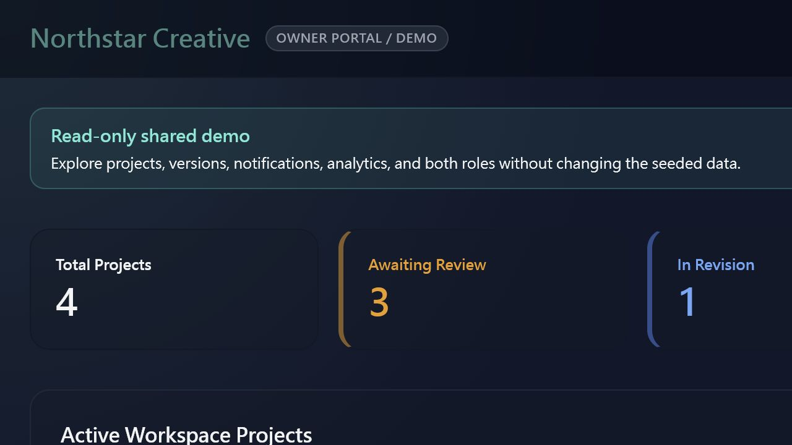
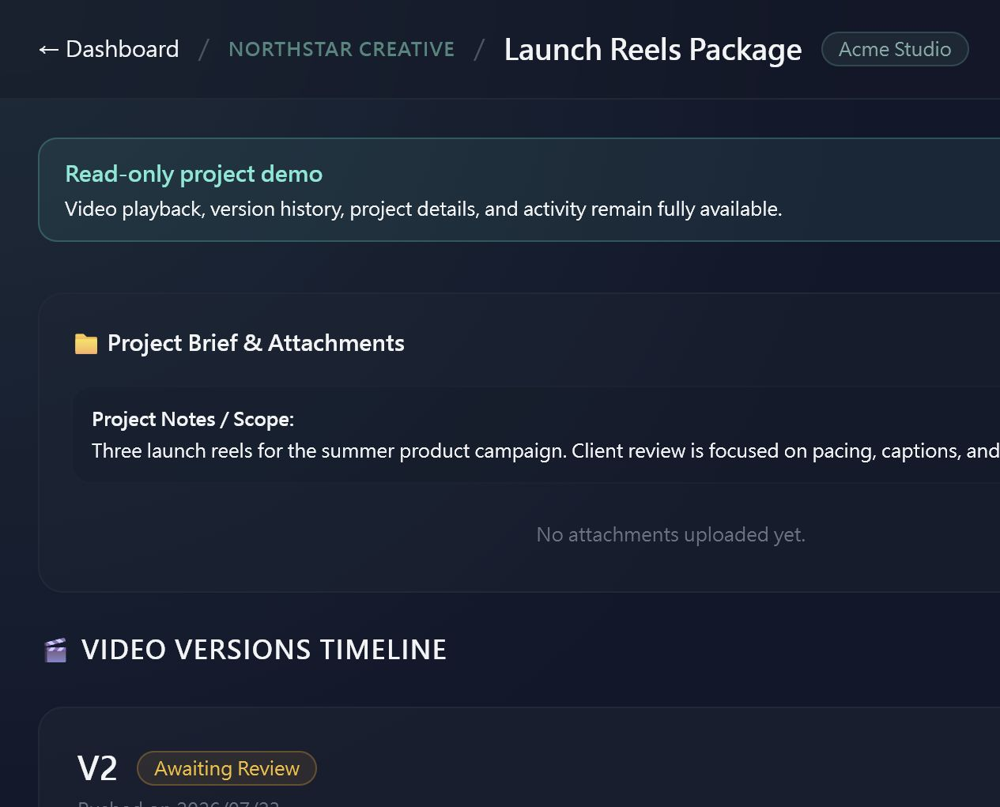
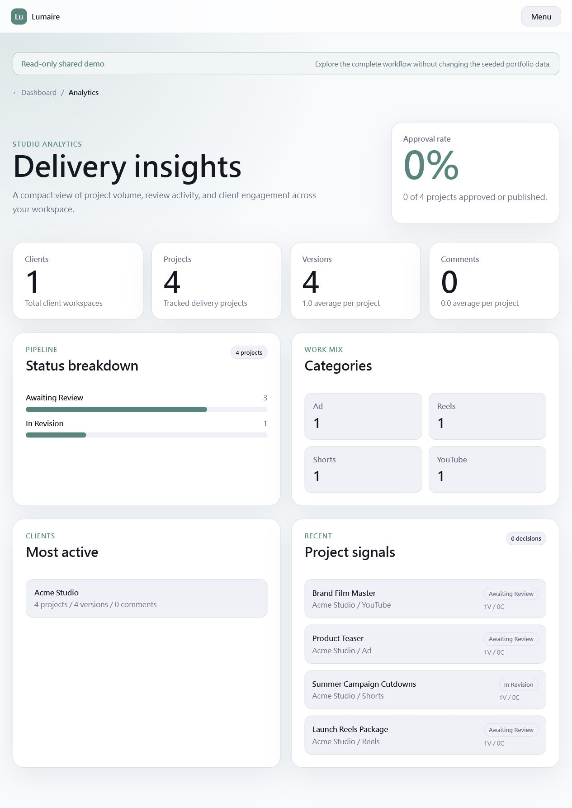
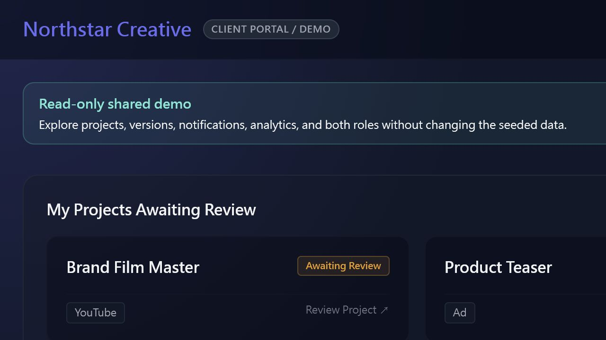
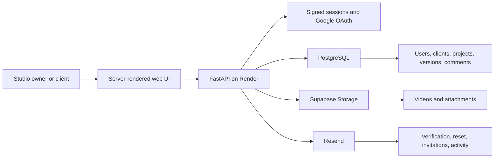

# Lumaire

Lumaire is a client review and delivery workspace for creative studios. It keeps video versions, client feedback, approvals, files, and project status in one focused portal instead of scattered email threads.

[Open the live demo](https://clientflow-q250.onrender.com/) · [Follow the 2-minute demo](docs/DEMO_GUIDE.md)

The landing page includes one-click access to two seeded, read-only roles:

- **Studio demo** shows the owner dashboard, project management, branding, notifications, and analytics.
- **Client demo** shows the private client portal and assigned review projects.

No credentials are required for the shared demo, and its portfolio data cannot be changed by visitors.

## Product Preview

| Studio workspace | Project review |
| --- | --- |
|  |  |

| Analytics | Client portal |
| --- | --- |
|  |  |

## What It Demonstrates

### Studio workflow

- Email registration, verification, password reset, and Google OAuth
- Guided workspace branding setup after registration
- Client creation with generated portal credentials and invitation email
- Project creation, categories, lifecycle status, and active project overview
- Video versions from external URLs or Supabase Storage uploads
- Attachments, public review links, final delivery, and activity timeline
- Notification center with per-project read state
- Analytics for clients, projects, versions, comments, and approval activity

### Client workflow

- Private portal limited to assigned projects
- Version playback, comments, revision requests, and approval signoff
- Public review links for reviewers who do not need an account
- Project activity displayed in each visitor's local timezone
- Responsive desktop and mobile layouts with persistent light/dark theme

### SaaS polish

- Studio name, logo, sender label, and brand color customization
- Consistent theme tokens across buttons, cards, fields, and status controls
- Read-only shared demo accounts with server-side mutation protection
- Responsive navigation, menus, notifications, modals, and forms

## Architecture



The frontend stays intentionally lightweight: FastAPI renders Jinja templates, while small JavaScript modules handle theme persistence, local-time formatting, menus, notifications, modals, and branding previews.

## Tech Stack

| Layer | Technology |
| --- | --- |
| Backend | FastAPI, Starlette, Jinja2 |
| Database | PostgreSQL with `psycopg2` |
| Storage | Supabase Storage |
| Email | Resend |
| Authentication | Password hashing, signed cookies, Google OAuth via Authlib |
| Frontend | Server-rendered HTML, CSS, vanilla JavaScript |
| Deployment | Render |

## Data Flow

1. A studio owner creates a client and project.
2. Lumaire sends the client invitation and stores project metadata in PostgreSQL.
3. The studio uploads a version to Supabase Storage or provides a hosted video URL.
4. The client reviews the version and submits a comment, revision request, or approval.
5. The dashboard, notification center, timeline, and analytics reflect the new activity.

## Demo Dataset

The seeded workspace uses **Northstar Creative** and **Acme Studio** to show multiple realistic project states:

- Launch Reels Package
- Summer Campaign Cutdowns
- Product Teaser
- Brand Film Master

Shared demo sessions are read-only. The backend blocks settings updates, client/project creation, uploads, review actions, attachments, password resets, and delivery changes for both demo identities.

## Run Locally

```powershell
git clone <your-repository-url>
cd clientflow_mvp
python -m venv .venv
.venv\Scripts\Activate.ps1
pip install -r requirements.txt
Copy-Item .env.example .env
uvicorn app.main:app --reload
```

Open `http://127.0.0.1:8000` after filling in the required values from `.env.example`.

## Environment Variables

| Variable | Required | Purpose |
| --- | --- | --- |
| `DATABASE_URL` | Yes | PostgreSQL connection string |
| `SESSION_SECRET` | Production | Signs login and OAuth session cookies |
| `RESEND_API_KEY` | For email | Verification, invitation, reset, and activity mail |
| `EMAIL_TEST_RECIPIENT` | No | Routes all outgoing mail to one test inbox |
| `GOOGLE_CLIENT_ID` | For Google login | Google OAuth client ID |
| `GOOGLE_CLIENT_SECRET` | For Google login | Google OAuth client secret |
| `SUPABASE_URL` | For uploads | Supabase project URL |
| `SUPABASE_KEY` | For uploads | Supabase server-side API key |
| `DEMO_ENABLED` | No | Enables one-click shared demo access |
| `DEMO_OWNER_EMAIL` | For demo | Seeded owner identity protected as read-only |
| `DEMO_CLIENT_EMAIL` | For demo | Seeded client identity protected as read-only |
| `ENABLE_DB_TEST` | No | Enables the diagnostic database route; keep off publicly |

Never commit real secrets. `.env` files, local databases, virtual environments, and Python caches are excluded by `.gitignore`.

## Deploy on Render

1. Push the repository to GitHub and create a Render web service.
2. Install dependencies with `pip install -r requirements.txt`.
3. Start with `uvicorn app.main:app --host 0.0.0.0 --port $PORT`.
4. Add the environment variables above in Render.
5. Point `DATABASE_URL` to PostgreSQL and configure Supabase Storage policies.
6. Add the Render callback URL to the Google OAuth client.

## Current Scope

Lumaire is a portfolio-ready MVP, not a full video hosting platform. It supports hosted video links and Supabase uploads so the core experience stays focused on client review and delivery.

Natural next steps are paid plan limits, team roles, durable notification records across devices, deeper review-time analytics, and automated end-to-end tests.
