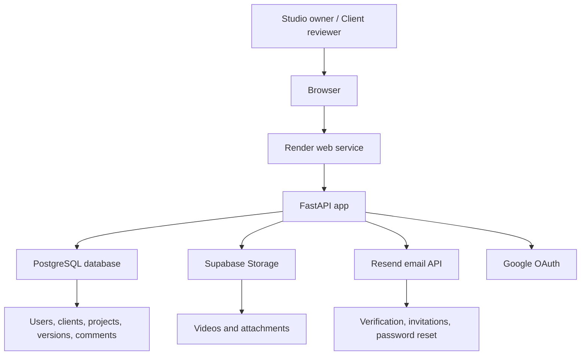

# Lumaire MVP

Lumaire is a calm creative delivery workspace for short-form video studios. It helps a studio owner manage clients, create projects, upload video versions, collect timestamped feedback, track approvals, and deliver final assets through a clean client portal.

The goal of this MVP is to show a realistic SaaS-style workflow without building a heavy video hosting platform from scratch.

## Live Demo

Production demo:

```text
https://clientflow-q250.onrender.com
```

Demo account details can be added here when you are ready to share a public reviewer login.

## Core Features

- Email registration, login, logout, and email verification
- Google OAuth login
- Forgot password and password reset flow
- Studio owner dashboard
- Client account generation and client portal access
- Client and project management
- Project status tracking: Awaiting Review, In Revision, Approved, Published
- Category support for Shorts, Reels, TikTok, Ads, YouTube, and Other
- Video version upload by URL or Supabase Storage upload
- Project attachment upload via Supabase Storage
- Public review links for clients
- Feedback comments, approve, and change request actions
- Activity timeline for project creation, uploads, and comments
- Local-time rendering for project activity timestamps
- Light/dark theme toggle
- Responsive mobile layout
- Development-only credentials panel for testing client accounts

## Tech Stack

- Backend: FastAPI, Starlette, Jinja2
- Database: PostgreSQL via `DATABASE_URL`
- Storage: Supabase Storage for video and attachment files
- Email: Resend
- Auth: Custom email/password auth, signed session cookies, Google OAuth via Authlib
- Deployment: Render
- Frontend: Server-rendered HTML templates with Tailwind CSS CDN

## Architecture



## Main User Flows

### Studio Owner

1. Register or log in.
2. Verify email.
3. Create clients.
4. Create projects for each client.
5. Upload video versions or paste external video links.
6. Send public review links.
7. Review comments and client decisions.
8. Mark approved projects as final delivered.

### Client Reviewer

1. Log in with generated client credentials or open a public review link.
2. View assigned projects.
3. Watch video versions.
4. Leave feedback, request changes, or approve a version.
5. Review project activity history.

### Password Reset

1. User opens Forgot Password.
2. User submits email.
3. App creates a reset token and sends a Resend email.
4. User opens reset link.
5. User sets a new password.
6. Reset token is cleared after use.

## Environment Variables

Create environment variables in Render or your local shell:

```env
DATABASE_URL=postgresql://...
SESSION_SECRET=replace-with-a-secure-secret

RESEND_API_KEY=re_...
EMAIL_TEST_RECIPIENT=optional-test-inbox@example.com

GOOGLE_CLIENT_ID=...
GOOGLE_CLIENT_SECRET=...

SUPABASE_URL=https://your-project.supabase.co
SUPABASE_KEY=...
```

Notes:

- `DATABASE_URL` is required for the current deployed app.
- `SESSION_SECRET` should be set in production.
- `EMAIL_TEST_RECIPIENT` is optional. When set, password reset emails are routed to that test inbox.
- Supabase Storage requires public buckets or compatible policies for uploaded videos and attachments.

## Run Locally

```bash
cd clientflow_mvp
python -m venv .venv
```

Windows PowerShell:

```powershell
.venv\Scripts\Activate.ps1
```

macOS/Linux:

```bash
source .venv/bin/activate
```

Install dependencies:

```bash
pip install -r requirements.txt
```

Set the required environment variables, then start the app:

```bash
uvicorn app.main:app --reload
```

Open:

```text
http://127.0.0.1:8000
```

## Deployment Notes

This MVP is designed for deployment on Render:

1. Push the repository to GitHub.
2. Create a Render web service.
3. Set the build/start commands.
4. Add the environment variables listed above.
5. Connect PostgreSQL and Supabase Storage.
6. Deploy.

Suggested start command:

```bash
uvicorn app.main:app --host 0.0.0.0 --port $PORT
```

## Screenshots

Screenshots can be added after the UI is finalized:

```text
docs/screenshots/dashboard-desktop.png
docs/screenshots/dashboard-mobile.png
docs/screenshots/project-review.png
```

## Roadmap

Completed MVP polish:

- Mobile UI improvements
- Success/error redirect feedback
- Forgot password flow
- Collapsed development credentials panel
- Local timezone display for project activity

Next priorities:

- Notification center for new comments, approvals, and uploads
- Studio settings for branding, logo, and sender name
- Better mobile-first dashboard layout
- Analytics for review time, revision count, and client activity
- Public README screenshots and demo credentials

## MVP Scope

Lumaire intentionally avoids becoming a full video hosting platform. The MVP supports external video URLs and Supabase Storage uploads so studios can keep hosting costs low while still presenting a professional client review workflow.
