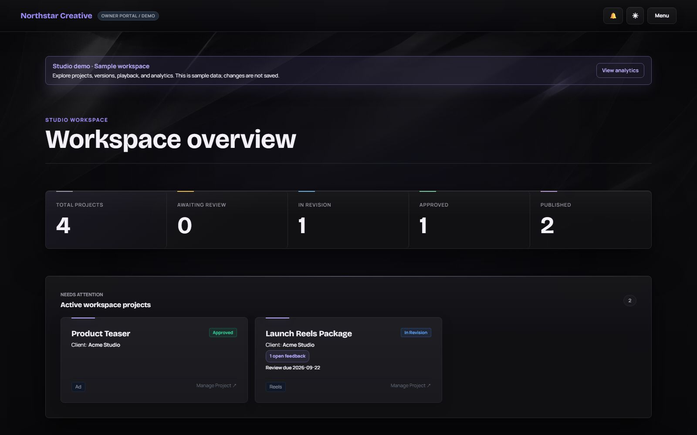
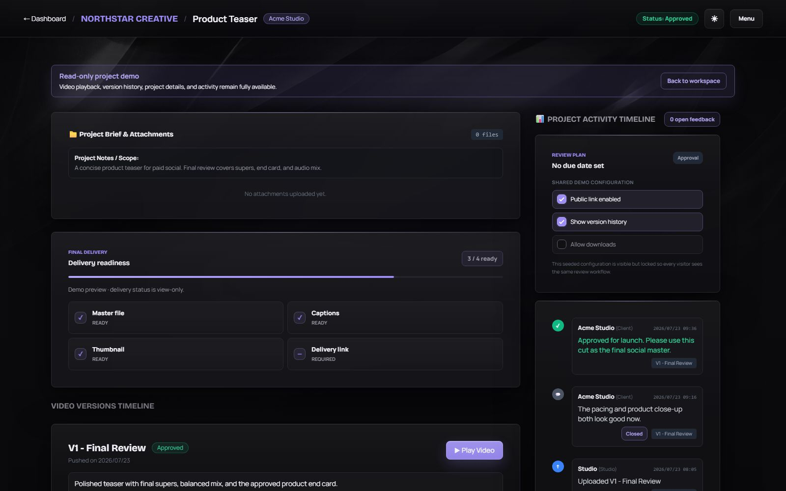
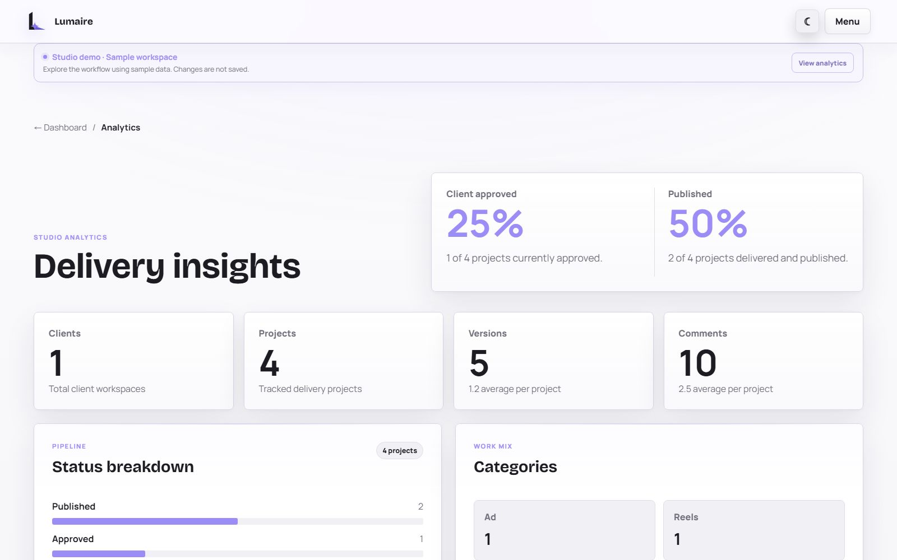
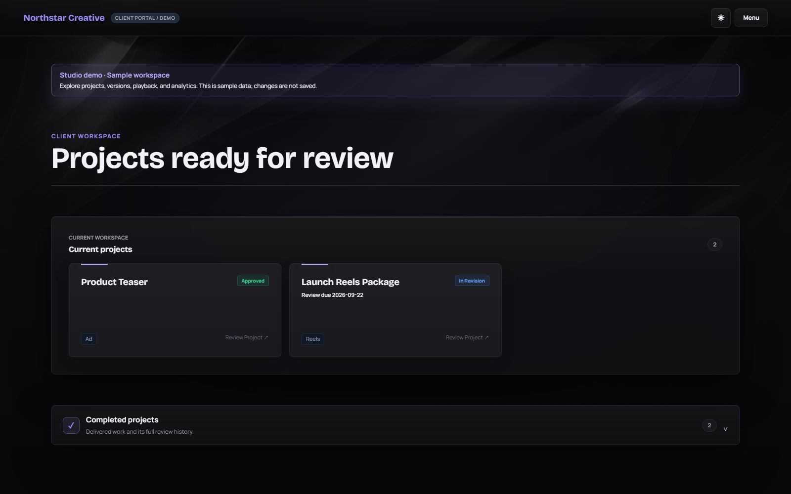
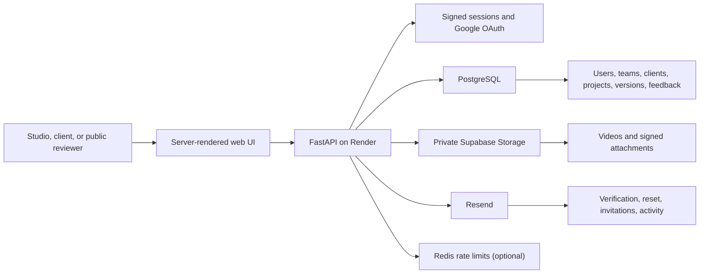

# Lumaire

Lumaire is a full-stack client review and delivery workspace for creative studios. It keeps video versions, contextual feedback, access rules, client decisions, and final-delivery readiness in one traceable workflow instead of scattered email threads.

[Open the live demo](https://lumaireflow.com/) | [Follow the 2-minute demo](docs/DEMO_GUIDE.md)

The public demo is designed for portfolio review: one click opens a seeded Studio or Client view, no credentials are required, and server-side guards prevent visitors from changing shared data. The production deployment uses a custom domain, HTTPS, PostgreSQL, private object storage, and verified transactional email.

## Why This Project

Lumaire was built around a product problem that appears simple but crosses several system boundaries: a creative team needs to share evolving work with the right people, preserve the context behind each decision, and know when a project is actually ready to deliver. The implementation therefore combines multi-role authorization, version history, review state, public-link permissions, private file delivery, notifications, analytics, and operational safeguards in one coherent application.

## Product Preview

| Studio workspace | Project review |
| --- | --- |
|  |  |

| Analytics | Client portal |
| --- | --- |
|  |  |

## Core Workflow

### Review and revision

- Upload hosted or Supabase-backed video versions without losing earlier decisions.
- Compare two versions side by side with synchronized playback controls.
- Collect comments, frame references, attachments, revision requests, and explicit client approvals.
- Resolve and reopen feedback while preserving the activity trail.
- Keep internal studio notes separate from client-visible discussion.
- Set a review due date and track unresolved feedback from the project sidebar.

### Sharing and access

- Give account-based clients a portal limited to assigned projects.
- Create public links with view, comment, or approval permissions.
- Add link expiry, password protection, version-history visibility, and download controls.
- Disable a public link immediately and review its visit count.
- Format activity timestamps in each visitor's local timezone.

### Delivery and lifecycle

- Track master file, captions, thumbnail, and delivery-link readiness.
- Lock approved work and reopen a review cycle when another revision is required.
- Archive and restore projects without deleting versions or audit history.
- Keep delivered projects available in a separate dashboard section.
- Review a chronological project activity stream with a dedicated scrollbar.

### Studio operations

- Create clients and projects from a dedicated workspace flow.
- Assign owner, admin, reviewer, or viewer roles with project-level access.
- Customize studio name, logo, sender label, and brand color.
- Use notifications with per-project read state and workspace analytics that report approval and publication separately.
- Manage email verification, password reset, Google OAuth, and account settings.

### Product experience

- Responsive desktop and mobile layouts with a persistent light/dark theme.
- Consistent theme tokens across buttons, cards, fields, status controls, and menus.
- Guided first-use hints that can be dismissed without blocking the workspace.
- Read-only shared demos with mutation protection enforced by the backend.

## Architecture


```mermaid
flowchart LR
    Visitor["Studio, client, or public reviewer"] --> Browser["Server-rendered web UI"]
    Browser --> App["FastAPI on Render"]
    App --> Auth["Signed sessions and Google OAuth"]
    App --> DB["PostgreSQL"]
    App --> Storage["Private Supabase Storage"]
    App --> Email["Resend"]
    App --> Cache["Redis rate limits (optional)"]

    DB --> Records["Users, teams, clients, projects, versions, feedback"]
    Storage --> Assets["Videos and signed attachments"]
    Email --> Messages["Verification, reset, invitations, activity"]
```

FastAPI renders Jinja templates. Small JavaScript modules handle theme persistence, local-time formatting, menus, notifications, modals, onboarding, and branding previews.

## Tech Stack

| Layer | Technology |
| --- | --- |
| Backend | FastAPI, Starlette, Jinja2 |
| Database | PostgreSQL with `psycopg2` |
| Storage | Supabase Storage |
| Email | Resend |
| Authentication | PBKDF2 password hashing, signed cookies, CSRF protection, Google OAuth via Authlib |
| Migrations | Alembic |
| Rate limiting | In-memory locally, Redis when `REDIS_URL` is configured |
| Frontend | Server-rendered HTML, CSS, vanilla JavaScript |
| Deployment | Render |

## Production Readiness

- Custom domain and managed HTTPS at [lumaireflow.com](https://lumaireflow.com/).
- Verified Resend sender domain for account verification, password reset, invitations, and activity mail.
- PostgreSQL migrations, startup preflight checks, private Supabase attachments, signed download URLs, and backup scripts.
- CSRF protection, signed sessions, password hashing, workspace isolation, role checks, and backend-enforced read-only demos.
- Automated coverage for authentication, permissions, review links, uploads, feedback state, delivery, archiving, and migration compatibility.
- Billing code is intentionally not exposed in the current interface; the portfolio build focuses on the complete review and delivery workflow.

## Data Flow

1. A studio owner creates a client and project.
2. Lumaire sends the invitation and stores project metadata in PostgreSQL.
3. The studio uploads a version to Supabase Storage or supplies a hosted video URL.
4. The client or public reviewer submits feedback, a revision request, or approval.
5. The studio resolves feedback, compares revisions, and prepares the delivery package.
6. The dashboard, notification center, timeline, and analytics reflect the complete history.

## Demo Dataset

The seeded workspace shows realistic projects across review, revision, approval, delivery, and archive states. It includes comments, repeated revision requests, version comparison, public-link controls, delivery readiness, analytics, and team access. Shared demo sessions are read-only on both the Studio and Client sides.

## Run Locally

```powershell
git clone <your-repository-url>
cd clientflow_mvp
python -m venv .venv
.venv\Scripts\Activate.ps1
pip install -r requirements.txt
Copy-Item .env.example .env
uvicorn app.main:app --reload
```

Open `http://127.0.0.1:8000` after filling in the required values from `.env.example`.

## Environment Variables

| Variable | Required | Purpose |
| --- | --- | --- |
| `DATABASE_URL` | Yes | PostgreSQL connection string |
| `DATABASE_SSLMODE` | No | PostgreSQL SSL mode; defaults to `require` |
| `SESSION_SECRET` | Production | Signs login and OAuth session cookies; use at least 32 random characters |
| `RUN_DB_MIGRATIONS` | Production | Runs Alembic migrations during startup |
| `RESEND_API_KEY` | For email | Verification, invitation, reset, and activity mail |
| `EMAIL_TEST_RECIPIENT` | Testing | Routes outgoing mail to one test inbox |
| `EMAIL_FROM_ADDRESS` | Production email | Sender address on a verified Resend domain |
| `GOOGLE_CLIENT_ID` | Google login | OAuth client ID |
| `GOOGLE_CLIENT_SECRET` | Google login | OAuth client secret |
| `SUPABASE_URL` | Uploads | Supabase project URL |
| `SUPABASE_KEY` | Uploads | Server-side Supabase key |
| `ATTACHMENTS_BUCKET_PRIVATE` | Recommended | Uses signed URLs for private attachments |
| `MAX_VIDEO_UPLOAD_MB` | No | Video upload limit; defaults to `250` MB |
| `MAX_ATTACHMENT_UPLOAD_MB` | No | Attachment upload limit; defaults to `25` MB |
| `REDIS_URL` | Multi-instance production | Shared rate-limit state across application instances |
| `STRIPE_SECRET_KEY` | Paid plans | Server-side Stripe API key |
| `STRIPE_WEBHOOK_SECRET` | Paid plans | Verifies subscription webhook events |
| `STRIPE_PRO_PRICE_ID` | Paid plans | Recurring Stripe Price ID for Pro |
| `STRIPE_BUSINESS_PRICE_ID` | Paid plans | Recurring Stripe Price ID for Business |
| `DEMO_ENABLED` | No | Enables one-click shared demo access |
| `DEMO_OWNER_EMAIL` | Demo | Seeded Studio demo identity |
| `DEMO_CLIENT_EMAIL` | Demo | Seeded Client demo identity |
| `ENABLE_DB_TEST` | No | Enables a diagnostic database route; keep off publicly |

Never commit real secrets. `.env` files, local databases, virtual environments, backups, and Python caches are excluded by `.gitignore`.

## Tests and Preflight

```powershell
python -m unittest discover -s tests -v
python -m compileall app migrations scripts tests
python scripts/preflight.py
```

The suite covers password migration, CSRF, review tokens, workspace isolation, role permissions, demo protection, uploads, feedback state, public links, delivery, archive/restore, and migration compatibility. The preflight script checks production configuration without printing secret values.

## Deploy on Render

1. Push the repository to GitHub and create a Render web service.
2. Install dependencies with `pip install -r requirements.txt`.
3. Start with `uvicorn app.main:app --host 0.0.0.0 --port $PORT`.
4. Configure the environment variables in Render.
5. Point `DATABASE_URL` to PostgreSQL and keep `RUN_DB_MIGRATIONS=true`.
6. Configure the Supabase `attachments` bucket as private and use a server-side key.
7. Add `https://lumaireflow.com/auth/google/callback` to the Google OAuth client.
8. Attach `lumaireflow.com` as the Render custom domain and point Cloudflare DNS to the Render service.

## Operations

Dry-run the attachment migration before making the bucket private:

```powershell
python scripts/configure_private_attachments.py
python scripts/configure_private_attachments.py --apply
```

Create database and attachment backups:

```powershell
python scripts/backup_database.py --output-dir backups --keep 14
python scripts/backup_attachments.py --output-dir backups
```

`compose.staging.yml` and `.env.staging.example` provide a separate staging environment. Keep backups outside the application container and test restores before relying on them.

## Current Scope

Lumaire is a production-minded MVP, not a transcoding or DRM platform. It supports hosted video links and Supabase uploads, but disabling downloads only removes Lumaire's download entry points; it cannot prevent screen recording or direct media capture.

The current public build deliberately leaves subscription checkout out of the navigation. Possible future work includes background video transcoding, expanded browser-level end-to-end coverage, richer reporting exports, and production billing if Lumaire moves from a portfolio project to a commercial service.
